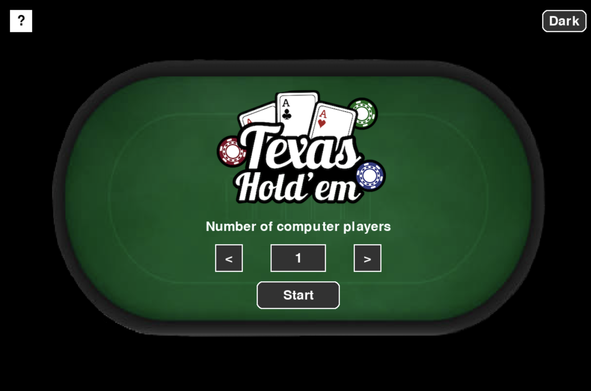

# Texas Holdem 
The Texas Holdem application can be used to simulate poker hands. 
Once launched, a user will be shown a poker board with empty hands and all 52 cards to choose from.
Users will be able to select their hand as well as the number of opponents and their hands. 
Based on the hands chosen, the program will show the implied odds or probability of winning and losing.
From the cards still available, the program will simulate the flop, turn and river.
After, the program will show which hand won.

The project will be done in python using the pygame library which is fast and easy to use for developers that have not had much experience with python or making programs that include UI. Github will be used for the version control.

Follow this project board to know the latest status of the project: https://github.com/orgs/cis3296s24/projects/86/views/1

Above is an image of what the application looks like.

## Table of Contents

- [Installation](#installation)
- [Controls](#controls)
- [Features](#features)
- [Demo](#demo)
- [Conclusion](#conclusion)

## Installation

1. Make sure you have Python installed. You can download it from [here](https://www.python.org/downloads/).
2. Install Pygame by running the following command: pip install pygame OR pip3 install pygame
3. Git clone https://github.com/cis3296s24/03-Texas-Holdem
4. Navigate to the project directory: cd projectName
5. To run the game, execute the following command in terminal: python homepage.py
6. or simply download the lastest release and run the homepage.exe file in the dist folder

Pygame should run and display, if issues, following tips may be helpful:
- **Main Branch**: Use for stable and latest releases.
- **Missing library/package to download**: If compiling error make sure to have all downloaded onto IDE: 
- joblib
- numpy
- pip
- pygame
- pygame-menu
- pyperclip
- scipy
- typing_extensions

## Controls/ How to use

- **Mouse/ cursor**: Used to navigate and use program interface
- Select number of computer players
- Click 'start' button
- Select 2 cards for every computer player with dropdown
- Click 'Run Flop' to simulate flop
- Click 'Generate' to generate winning rate
- Click 'Reset' to restart game
- Preious 3 steps can be done inconurrently 

## Features

Main features of program:
- Program creates a new window through Pygame that displays a poker table.
- Program has custom UI poker theme with graphics, colors, fonts
- Program as light/dark mode
- Program has help menu
- Program can have multiple computer players (1-5)
- Program is able to customize each players’ cards in hand
- Program calculates the win rate for each player by simulating the table's card.
- Program is able to keep track of cards selected in order to simulate the flop, and win rate.
- Program is able to reset

Below is for 5 files that handle main functionality 

### `homePage` Class:
1. **Dropdown Menu**: Allows selection of the number of computer players.
2. **Start Button**: Initiates the game with the selected number of players.
3. **Dark Mode Toggle**: Enables switching between light and dark modes for the interface.
4. **Instructions Button**: Opens game instructions in a separate Python file.

### `dropDownMenu` Class:
1. **Card Selection**: Users can select a card from the dropdown menu.
2. **Scrollbar**: A scrollbar is included to navigate through the list of available cards, especially when the list exceeds the visible area.
3. **Random Card Selection**: Provides a method (`get_random_cards`) to select random cards from the available options, excluding those already selected.
4. **Event Handling**: Handles mouse events for button clicks, dropdown opening/closing, and scrollbar dragging.
5. **Drawing Dropdown Menu**: Draws the dropdown menu on the screen, including the options and scrollbar.
6. **Displaying Selected Card**: Displays the selected card's image on the screen for demonstration purposes.

### `tableModel` Class:
1. **Pygame Setup**: Initializes Pygame, sets the screen size, clock, and running state.
2. **Dropdown Menu**: Implements a dropdown menu for selecting playing cards.
3. **Button Interactions**: Responds to button clicks for reset, running flop, and calculating win rates.
4. **Color Modes**: Supports both light and dark color modes for the interface.
5. **Image Handling**: Loads and resizes images for the poker table background and playing cards.
6. **Card Conversion**: Converts strings representing cards into Card objects for processing.
7. **Random Card Selection**: Selects random cards excluding those already selected.
8. **Event Handling**: Manages mouse events for button clicks and dropdown interactions.
9. **Drawing Interface**: Draws the graphical interface including buttons, dropdown, selected cards, and flop.
10. **Card Display**: Displays selected cards on the screen with their corresponding images.
11. **Win Rate Calculation**: Calculates win rates based on selected cards and number of players.
12. **Winner Identification**: Identifies the winner based on the highest ranking hand.

### `card` Class:
1. **Initializes**: Initializes a set of cards representing a poker hand for each player.
2. **Print Win Rate**: Simulates poker games with the given hands and prints the win rates for each player.

### `ranker` Class:
1. **Evaluation**:Efficient NumPy operations for hand evaluation.
2. **Identify**:Support for identifying various poker hand ranks.
3. **Special Cases**:Handling of special cases such as ace-high and ace-low straights.
4. **Stores Results**:Utilizes NumPy arrays for storing intermediate results.
5. **Extension and Modification**:Modular structure allowing easy extension and modification of hand ranking logic.

## Demo
Video showing demo of program running. Click image to play.

## Conclusion
Over 4 weeks, we crafted a tool to assist poker players in their Texas Hold'em games. Born from our love for programming and poker, we developed a solution to simplify hand evaluation and enhance gameplay.

Using agile methods like Scrum, we worked collaboratively, adapting to changes and delivering improvements iteratively. Comprehensive testing ensured our program's reliability and accuracy, instilling confidence in its functionality.

As we conclude this phase, we thank everyone involved for their contributions. We're proud of what we've achieved and excited to see how our program will benefit poker players.

Thank you for considering Texas Hold'em for your poker needs. Happy coding, and may the best hand win!

Authors: Joe Zhou, Jasmine Liu, Arjun Patel, Vincent Schetroma, Jacob Creasy
